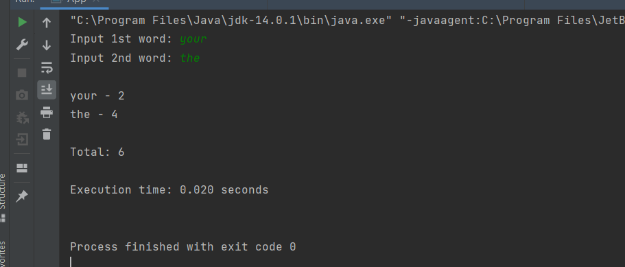

## Your Info:
1. Matric Number: 270607
1. Name: Tan Yi Qing

## Instruction:

1. Write a Java program to count the total words of __TWO (2)__ selected words from the `RossBeresford.txt` below:

   https://github.com/STIW3054-A211/Template-Tutorial-7/blob/master/src/RossBeresford.txt

1. Your program should implement `CountDownLatch`; where the total words will be counted after each word has been counted.

1. The words must be input from the keyboard.

1. Calculate the execution time.

1. The program file and the class name which has the main method should be named `App.java` and place in the `src` folder.

1. Screenshot the result and upload to this repo too.

1. Watch the video to clone, add, commit and push a repository to GitHub: https://youtu.be/RXV3Yusr0SI


## Expected Output (example):
```
Input 1st word: your
Input 2nd word: the

your - 2
the - 4

Total: 6

Execution time: 0.005 seconds
```


## Your Output/Result


